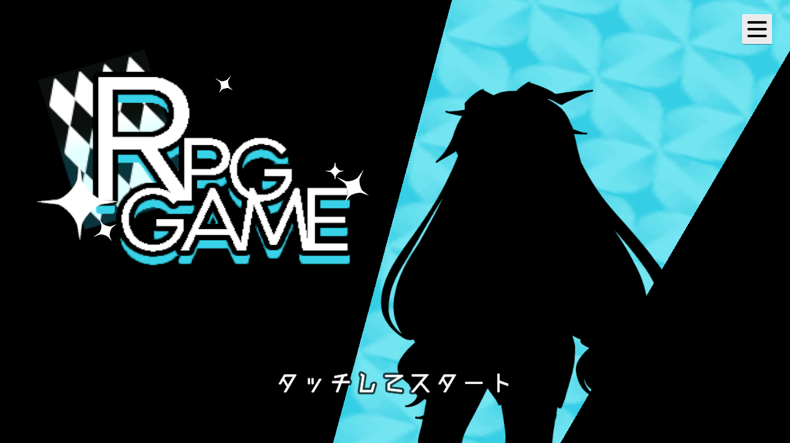

# RPGGAME
 

### 目次
---
1. 自己紹介
2. 紹介動画 
3. 作品概要 
4. 制作環境 
5. 技術紹介 
6. こだわり 
7. 参考サイト・使用素材 

### 1. 自己紹介
---
<dd>
河原電子ビジネス専門学校　ゲームクリエイター科2年 
野村 華生(のむら かなり)  
ゲーム、絵を描くこと、写真を撮ることが趣味です。
</dd>

### 2. 紹介動画
---
<dd>

[プレイ動画](https://www.youtube.com/watch?v=3p30X7y2MSg "https://www.youtube.com/watch?v=3p30X7y2MSg")
</dd>

### 3. 作品概要
---
<dd>
    <dd>
    プレイ人数 
    1人 
    </dd> 
    <dd>
    ジャンル 
    RPG 
    </dd> 
    <dd>
    対応ハード 
    Windows11、Android 
    </dd> 
</dd>

### 4. 制作環境
---
<dd>
    <dd>
    制作期間 
    2023年11月～2024年3月 
    </dd> 
    <dd>
    制作人数 
    1人 
    </dd> 
    <dd>
    使用言語 
    C#、HLSL 
    </dd> 
    <dd>
    使用ツール 
    Unity2021.3.23f1 
    Visual Studio 2022 
    Visual Studio Code 
    Adobe Photoshop 2022 
    fork 
    Github 
    Github Large File Storage 
    </dd> 
</dd>

### 5. 技術紹介
---
#### 5.1. エディタ拡張
<dd>
 
本作ではプレイヤーデータ、エネミーデータ等、膨大な量のデータを使用しています。 そのデータを簡単に、わかりやすく扱うためにエディタ拡張を追加しています。

 
いくつかあるデータの中でも、エネミーデータが最も多く、データ入力、データ追加を考えると非常に効率が悪くなることが考えられるため、エディタ拡張を導入しました。  
データとして扱っているものすべてをエディタとして管理できるようにしたため、データを簡単に管理できるようになりました。
</dd>

#### 5.2. セーブデータの暗号化
<dd>
本作ではプレイヤーのステータス、スキル、ステージのクリア状況などをセーブデータで保存し、記録しています。 
しかし、暗号化を実装しない限り中身の改変が可能なため、暗号化を実装しました。 
</dd>

#### 5.3. Unitask
<dd>
ゲームオーバー、ゲームクリアなどの判定を行うほか、演出部分で一定時間待機する等の処理に使用しています。 
※黄色のラインの部分がUnitaskのコード 
 
▲ 演出の終了処理

 
▲ ゲームの終了処理

</dd>

### 6. こだわり
---
<dd>

#### 6.1. 絵文字
テキストと同時にアイコンを表示したいと考え、絵文字を使用しました。 
 
 

</dd>

<dd>

#### 6.2. アニメーション
 
UIにこだわりたいと考え、ボタンを押したときなどのアニメーションを個別に追加しています。 
同一のAnimatorを使用しており、同じスクリプトをアタッチして設定するだけで制御できるようにしています。

 
また、システムのセーブが行われた際の専用のアニメーションを追加しました。 
アニメーションイベントを使用し、回転が行われた瞬間に画像を差し替えて表裏があるように見せています。

スートが描かれた画像は乱数を設定して決定しており、毎回ランダムに切り替わるようにしています。

</dd>

### 7.使用素材
---
<dd>

[RPGドット【Rド】](http://rpgdot3319.g1.xrea.com/muz/002.html "http://rpgdot3319.g1.xrea.com/muz/002.html") 
七三ゆきのアトリエ 
[自家製フォント工房](http://jikasei.me/font/jf-dotfont/ "http://jikasei.me/font/jf-dotfont/") 
[ひみつ ゲーム用フリー素材](http://uros.web.fc2.com/frame.html "http://uros.web.fc2.com/frame.html") 
© Unity Technologies Japan/UCL 

</dd>